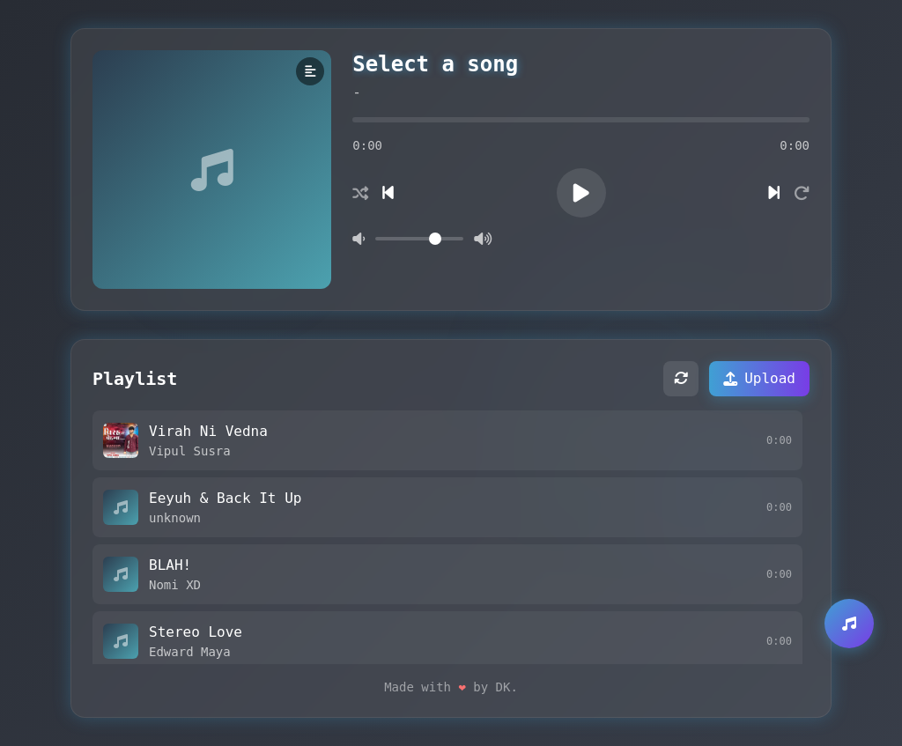

> **⚠️ Found a bug or issue?**  
> If you encounter or find any error, **do not hesitate to report it in the [Issues](../../issues) section**.  
> This helps me identify and fix problems more effectively. Thank you!

---

# Music Player Web App

A simple, dynamic PHP-based music player web application that allows users to browse, play, and manage a list of music tracks. It features a modern interface and is built with security and accessibility in mind.

## Features

- **Dynamic Music Listing:** Automatically lists all songs from the database, displayed in a user-friendly playlist.
- **Interactive Audio Player:** HTML5-based music player with play, pause, next, previous, shuffle, and repeat functionalities. Includes a visual progress bar and volume control.
- **Song Uploads:** Users can upload new songs (MP3 format) with optional cover art, title, artist, album, and lyrics through an intuitive modal form.
- **Secure File Uploads:** Implements MIME type validation on the backend to ensure only valid audio and image files are uploaded.
- **Database Integration:** Uses PDO for secure and efficient interaction with a MySQL database. The database schema (`database.sql`) is optimized with `InnoDB`, `utf8mb4` for Unicode, and includes fields for `album` and `track_order`.
- **Responsive UI:** Clean, modern interface built with Tailwind CSS, designed for a seamless listening experience across devices.
- **Accessibility Enhancements:** Improved semantic HTML structure and ARIA attributes for better usability with assistive technologies.
- **Visualizations:** Includes subtle background visualizer effects and a waveform display for the currently playing song.
- **Externalized Configuration:** Key settings (database credentials, upload directory) managed in `config.php` for easier setup and security.
- **Album Information:** Supports storing, displaying, and editing song album information.
- **Playlist Reordering:** Users can drag and drop songs to reorder the playlist, with the order persisted in the database via the `track_order` column.
- **Client-Side Playlist Search:** Instantly search/filter the current playlist by song title, artist, or album.
- **Song Metadata Editing:** Ability to edit title, artist, and album for existing songs directly within the application.
- **User Preferences Saved:** The player remembers volume, shuffle/repeat settings, and the last played song/position across sessions using Local Storage.
- **Theme Options:** User-selectable Light and Dark modes, with the preference saved across sessions for a personalized experience.
- **Polished UI:** Features smoother modal transitions and an overall refined user interface for enhanced visual appeal and usability.

## Demo

  


## Technologies Used

- **Frontend:** HTML5, CSS3 (Tailwind CSS, custom styles), JavaScript (ES6+, SortableJS for playlist reordering)
- **Backend:** PHP 8.0+ (utilizing PDO for database interaction, reads configuration from `config.php`)
- **Database:** MySQL (schema uses InnoDB engine, `utf8mb4` charset, and includes `album` and `track_order` columns)
- **Audio:** HTML5 `<audio>` element with extensive JavaScript controls.
- **Accessibility:** ARIA attributes and semantic HTML for improved screen reader support.
- **Configuration Management:** Centralized `config.php` for application settings.

## Getting Started

Follow these steps to set up the project on your local machine:

### Prerequisites

- PHP 8.0 or above (with PDO_MySQL extension enabled)
- MySQL
- Web server (e.g., XAMPP, Apache, Nginx)

### Installation

1. **Clone the repository:**
   ```bash
   git clone https://github.com/druvx13/music-player.git
   cd music-player
   ```

2. **Import the Database:**
   - Open your MySQL management tool (e.g., phpMyAdmin).
   - Create a new database (e.g., `music_db_neon`).
   - Import the `database.sql` file into this database. This file defines the `songs` table structure.
   - **Note:** The database schema uses the `InnoDB` engine, `utf8mb4` character set (for comprehensive Unicode support), and includes columns for `album` (VARCHAR) and `track_order` (INT for custom playlist sorting).

3. **Configure the Application:**
   - **Create `config.php`:** If you cloned the repository, a `config.php` file should already exist. If not, you might need to create it from a template or copy the example below.
   - **Update `config.php`:** Open `config.php` in the root directory and modify the following settings:
     ```php
     <?php
     // Database configuration
     $host = "localhost"; // Or your specific host
     $db = "your_db_name";     // Your database name (e.g., music_db_neon)
     $user = "your_db_user"; // Your database username
     $pass = "your_db_password"; // Your database password

     // Upload directory
     $uploadDir = 'uploads/'; // Default is 'uploads/'. Ensure this path is correct and writable by the server.

     // Optional: Error reporting (useful for development)
     // error_reporting(E_ALL);
     // ini_set('display_errors', 1);
     ?>
     ```
   - **Secure `config.php`:** This file contains sensitive database credentials. It's crucial to protect it from direct browser access.
     *   **Recommended:** If possible, place `config.php` outside your web server's document root (e.g., one level above `public_html` or `www`). You would then need to adjust the `require_once` path in `index.php` accordingly (e.g., `require_once __DIR__ . '/../config.php';`).
     *   **Alternative (if outside web root is not possible):** Use an `.htaccess` file in the same directory as `config.php` (or your main `.htaccess` if `config.php` is in the root) to deny direct access. Create an `.htaccess` file with the following content:
       ```apache
       <Files "config.php">
           Require all denied
       </Files>
       ```
       *(For older Apache versions, you might use `Order allow,deny` and `Deny from all`)*.
       Always check your hosting provider's documentation for the best way to protect files.

4. **Ensure Upload Directory is Writable:**
   - The `uploads/` directory (or the custom path set in `$uploadDir` in `config.php`) must exist and be writable by your web server (PHP process). You might need to set appropriate permissions (e.g., `chmod 755 uploads` or `chmod 775 uploads` depending on your server setup).

5. **Add Your Music Files:**
   - Upload your MP3 audio files and optional cover images (JPEG, PNG, GIF) using the "Upload" button within the application.
   - Song metadata (title, artist, album, lyrics) can also be added or edited through the application.
   - Uploaded files are stored in the `uploads/` directory, and their metadata is saved to the MySQL database.

6. **Run the App:**
   - Ensure your web server is running and configured to serve PHP files from the project directory.
   - Open your browser and navigate to the `index.php` file (e.g., `http://localhost/music-player/index.php` or your configured virtual host).

## Project Structure

```
music-player/
├── config.php            # Application configuration (database, paths) - **SECURE THIS FILE!**
├── uploads/              # Directory for storing uploaded song files and cover art (must be writable)
├── index.php             # Main application file (PHP backend, HTML, CSS, JavaScript)
├── database.sql          # MySQL database schema file
├── README.md             # This file
├── LICENSE               # Project license information (MIT License)
```

## License

This project is licensed under the **MIT License**.
See the [LICENSE](./LICENSE) file for the full license text. The license information can also be viewed within the application via a link in the footer.


---
