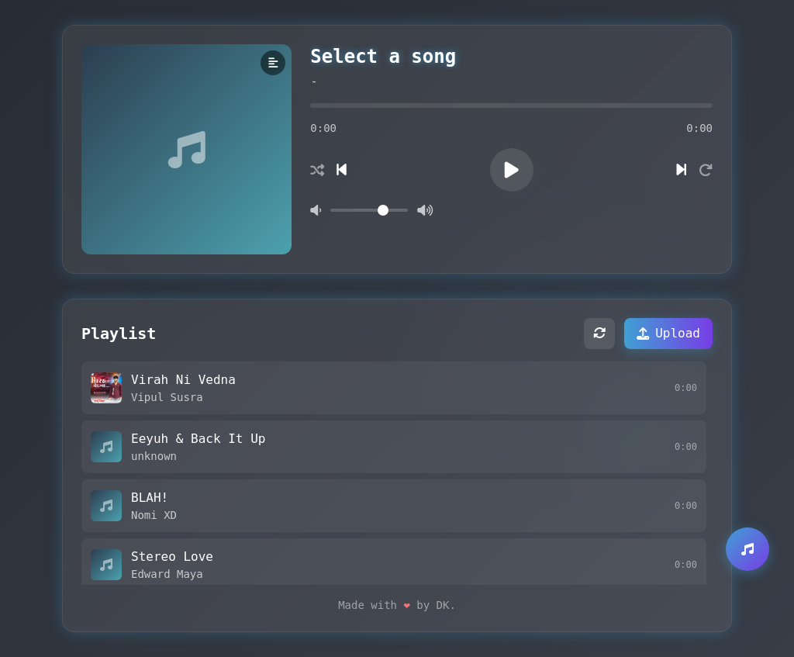

```markdown
# Neon Wave Music Player

> **⚠️ Found a bug or issue?**  
> If you encounter or find any error, **do not hesitate to report it in the [Issues](../../issues) section**.  
> This helps in identifying and fixing problems more effectively. Thank you!

---

A simple, dynamic PHP-based music player web application that allows users to browse, play, and manage a list of music tracks stored in a MySQL database, now with an improved project structure for better security and maintainability.

## Features

- **Music Listing:** Automatically lists all songs from the database.
- **Audio Player:** Modern HTML5-based music player with play, pause, next, previous, shuffle, repeat, and progress functionality.
- **Dynamic Waveform Display:** Visual feedback during playback.
- **Volume Control:** Adjust playback volume.
- **Database Integration:** Fetches song data (title, artist, file path, cover art path, lyrics) directly from a MySQL database.
- **Song Uploads:** Easily upload new MP3 tracks with optional cover art, artist details, and lyrics via a user-friendly interface.
- **Lyrics Display:** View lyrics for the current song if available.
- **Responsive UI:** Minimal, functional, and aesthetically pleasing interface built with Tailwind CSS.
- **Mini-Player Support:** Integrates with browser media session for background control.

## Demo Screenshot


*(Screenshot shows the general UI of the music player)*

## Technologies Used

- **Frontend:** HTML, CSS (Tailwind CSS), JavaScript
- **Backend:** PHP
- **Database:** MySQL
- **Audio:** HTML5 `<audio>` tag
- **Icons:** Font Awesome

## Project Structure

The project follows a structured directory layout to separate concerns:

```
music-player/
├── public/                   # Web server's document root (configure your server to point here)
│   ├── index.php             # Main HTML shell and entry point
│   ├── assets/               # Frontend assets
│   │   ├── css/
│   │   │   └── style.css     # Custom CSS styles
│   │   ├── js/
│   │   │   └── main.js       # Main JavaScript for player logic
│   │   └── images/
│   │       └── gtavc-matrix-dk-eu-org-1024xFULLdesktop-dacc32.png # Demo image
│   └── uploads/              # User-uploaded music and cover art (writable by web server)
│       └── .gitkeep          # Ensures directory is version controlled
│
├── src/                      # PHP source files (backend logic - not publicly accessible)
│   ├── api.php               # Handles API requests (getPlaylist, uploadSong)
│   └── config/
│       ├── db.php            # Database connection helper
│       ├── config.php        # User-specific database credentials (gitignored)
│       └── config.php.template # Template for config.php
│
├── database.sql              # MySQL database schema dump
├── LICENSE                   # Project license file
└── README.md                 # This file
```

## Getting Started

Follow these steps to set up the project on your local machine:

### Prerequisites

- PHP 7.4 or above (with `mysqli` and `fileinfo` extensions enabled)
- MySQL 5.7 or above (or MariaDB equivalent)
- Web server (e.g., Apache, Nginx, XAMPP, WAMP, MAMP)
- Git (for cloning the repository)
- Composer (optional, if future PHP dependencies are added)

### Installation

1.  **Clone the repository:**
    ```bash
    git clone https://github.com/druvx13/music-player.git
    cd music-player
    ```

2.  **Set up Database Configuration:**
    *   Navigate to the `src/config/` directory.
    *   Copy the template file:
        ```bash
        cp config.php.template config.php
        ```
    *   Open `src/config/config.php` in a text editor and update the database credentials:
        ```php
        <?php
        // src/config/config.php
        define('DB_HOST', 'localhost');     // Your database host
        define('DB_NAME', 'musicdb');       // Your database name
        define('DB_USER', 'your_db_user');  // Your database username
        define('DB_PASS', 'your_db_password'); // Your database password
        ?>
        ```

3.  **Import the Database Schema:**
    *   Access your MySQL management tool (e.g., phpMyAdmin, command line).
    *   Create a new database (e.g., `musicdb`, matching what you set in `config.php`).
    *   Import the `database.sql` file (located in the project root) into this newly created database.

4.  **Configure Your Web Server:**
    *   Set the web server's **document root** (or "web root") to the `public/` directory inside your cloned `music-player` project.
        *   **Apache:** You might need to edit `httpd.conf` or a virtual host configuration file. Example for a Virtual Host:
            ```apache
            <VirtualHost *:80>
                ServerName musicplayer.local
                DocumentRoot "/path/to/your/music-player/public"
                <Directory "/path/to/your/music-player/public">
                    AllowOverride All
                    Require all granted
                    DirectoryIndex index.php
                </Directory>
            </VirtualHost>
            ```
        *   **Nginx:** Example server block:
            ```nginx
            server {
                listen 80;
                server_name musicplayer.local;
                root /path/to/your/music-player/public;
                index index.php;

                location / {
                    try_files $uri $uri/ /index.php?$query_string;
                }

                location ~ \.php$ {
                    include snippets/fastcgi-php.conf;
                    fastcgi_pass unix:/var/run/php/php7.4-fpm.sock; # Adjust to your PHP-FPM version/socket
                    fastcgi_param SCRIPT_FILENAME $document_root$fastcgi_script_name;
                    include fastcgi_params;
                }

                location ~ /\.ht {
                    deny all;
                }
            }
            ```
    *   Ensure URL rewriting is enabled if your server requires it (e.g., `mod_rewrite` for Apache).
    *   **Note on `.htaccess` files:**
        *   The `public/.htaccess` file is configured to route requests within the `public` directory to `public/index.php` (front controller).
        *   A `.htaccess` file is also provided in the project root. Its purpose is to redirect all traffic to the `public/` subdirectory. This is useful if you cannot set your web server's document root directly to `public/` (common in some shared hosting environments). If your document root *is* set to `public/`, the root `.htaccess` may not be strictly necessary but generally won't harm.

5.  **Set Permissions:**
    *   The `public/uploads/` directory needs to be writable by your web server user (e.g., `www-data`, `apache`).
        ```bash
        # Example: Adjust user/group as necessary
        sudo chown www-data:www-data public/uploads
        sudo chmod 775 public/uploads
        ```
        *(Use `755` if `775` is too permissive and your web server user is the owner. `777` is generally discouraged for security reasons.)*

6.  **Access the Application:**
    *   Open your browser and navigate to the URL you configured for your web server (e.g., `http://localhost/music-player/` if using a subdirectory under your default web root, or `http://musicplayer.local` if you set up a virtual host).

### Adding Music

-   Once the application is running, click the "Upload" button.
-   Fill in the song details (title, artist, lyrics (optional)).
-   Choose a cover image (optional).
-   Select the MP3 song file.
-   The uploaded songs and their covers will be stored in the `public/uploads/` directory, and their metadata will be saved in the database.

## Development

-   **PHP Backend:** Logic is primarily in `src/api.php`. Database interactions are managed via `src/config/db.php` using credentials from `src/config/config.php`.
-   **Frontend Assets:** Custom CSS is in `public/assets/css/style.css`. JavaScript is in `public/assets/js/main.js`.
-   **Dependencies:** Tailwind CSS and Font Awesome are loaded via CDN.

## Contributing

Contributions are welcome! If you'd like to contribute:

1.  Fork the repository.
2.  Create a new branch (`git checkout -b feature/YourFeatureName`).
3.  Make your changes.
4.  Commit your changes (`git commit -m 'Add some amazing feature'`).
5.  Push to the branch (`git push origin feature/YourFeatureName`).
6.  Open a Pull Request.

Please ensure your code follows the existing style and that any new features are well-documented.

## License

This project is licensed under the **GNU General Public License v3.0 (GPL-3.0)**.  
See the [LICENSE](./LICENSE) file for more details.

---

Made with ❤️ by DK.
```
